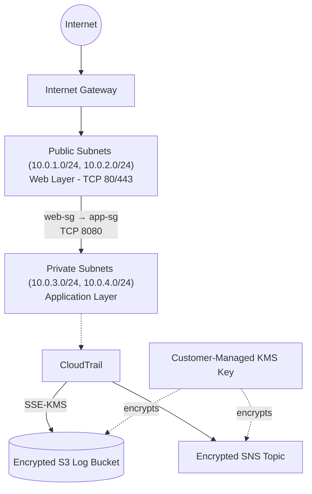

# Secure Cloud Infrastructure

**A defense-in-depth AWS foundation built with Terraform, hardened and validated by an automated DevSecOps pipeline.**


## Overview

This repository implements a segmented, least-privilege AWS network with centralized audit logging and encryption — verified both by an automated Checkov/pytest pipeline and by direct AWS CLI inspection of the deployed resources. It's designed as a security-first baseline that other workloads (EC2, RDS, etc.) can be layered onto.

## Architecture at a Glance



Full diagrams: [Overall Architecture](diagrams/overall-architecture.md) · [Network](diagrams/network-architecture.md) · [IAM](diagrams/iam-architecture.md) · [Logging & Encryption](diagrams/logging-encryption.md)

## Security Capabilities

| Layer | Controls | Details |
|---|---|---|
| **Network** | Public/private subnet split, security-group scoped ingress, no SSH/RDP exposed, locked-down default SG | [network-architecture.md](diagrams/network-architecture.md) |
| **IAM** | Dedicated `infrastructure`, `workload`, `monitoring` roles; resource-scoped ARNs; documented `Resource = "*"` exceptions | [iam-architecture.md](diagrams/iam-architecture.md) |
| **Encryption** | Customer-managed KMS key with auto-rotation, SSE-KMS on S3, encrypted SNS topic | [logging-encryption.md](diagrams/logging-encryption.md) |
| **Audit** | Multi-region CloudTrail, log-file validation, versioned + HTTPS-only S3 bucket | [security-baseline.md](docs/security-baseline.md) |
| **CI/CD** | `terraform fmt`/`validate`, Checkov scan, `detect-secrets`, pytest security suite | [security-testing.md](docs/security-testing.md) |

## Verified Results

| Check | Result |
|---|---|
| Terraform fmt / validate | ✅ Pass |
| Checkov scan | ✅ 92 passed / 0 failed / 11 skipped |
| Secret scan (detect-secrets) | ✅ Pass |
| Security tests (`pytest`) | ✅ 20 passed |
| CloudTrail log integrity (real AWS) | ✅ 1/1 digests, 13/13 log files valid |

Full pipeline definition: [`.github/workflows/security-pipeline.yml`](.github/workflows/security-pipeline.yml)

## Tech Stack

| Category | Technology |
|---|---|
| IaC | Terraform 1.15.8 |
| Cloud | AWS (VPC, IAM, KMS, S3, CloudTrail, SNS) |
| Security scanning | Checkov 3.3.18, detect-secrets 1.5.0 |
| Testing | pytest, Python 3.12 |
| CI/CD | GitHub Actions |

## Quick Start

```bash
# Authenticate via AWS IAM Identity Center (recommended over long-lived keys)
aws configure sso --profile cloud-security
aws sso login --profile cloud-security

# Terraform workflow
terraform -chdir=terraform init
terraform -chdir=terraform validate
terraform -chdir=terraform plan -var="aws_region=eu-central-1" -out=tfplan
terraform -chdir=terraform apply tfplan
```

Full SSO setup: [AWS CLI SSO configuration guide](https://docs.aws.amazon.com/cli/latest/userguide/cli-configure-sso.html)

## Repository Structure

```
secure-cloud-infrastructure/
├── .github/workflows/security-pipeline.yml
├── diagrams/            # Architecture diagrams
├── docs/                # Threat model, baseline, incident response, cost safety
├── modules/             # encryption, iam, logging, network, security
├── terraform/           # main.tf, variables.tf, outputs.tf, providers.tf
├── tests/test_security.py
└── security/reports/
```

## Documentation

- [Security Baseline](docs/security-baseline.md)
- [Threat Model](docs/threat-model.md)
- [Security Testing](docs/security-testing.md)
- [Incident Response](docs/incident-response.md)
- [AWS Cost Safety](docs/aws-cost-safety.md)

## Roadmap

Intentionally deferred from this security baseline: NAT Gateway, EC2/RDS workloads, VPC Flow Logs, CloudWatch/SIEM integration, remote Terraform state + locking, GitHub Actions OIDC deployment, and an SNS subscriber for alert delivery.

## License

See [LICENSE](LICENSE).
