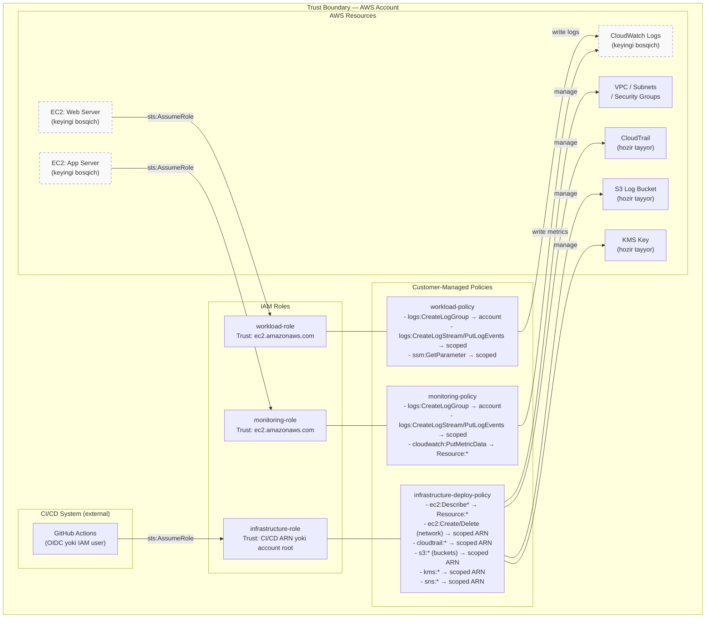

# IAM Architecture

> **Holat:** Kod tayyorlangan, AWS resurslari hali real yaratilmagan.

## Maqsad

Har bir rol yoki xizmatga faqat o'z vazifasi uchun kerak bo'lgan minimal huquqlarni berish — **Principle of Least Privilege**.

## IAM arxitekturasi diagrammasi

## Rollar tavsifi

### Infrastructure Role
- **Maqsad:** Terraform/CI orqali tarmoq, IAM va logging resurslarini boshqarish
- **Trust:** CI/CD ARN yoki account root (fallback)
- **Cheklovi:** `AdministratorAccess` berilmagan; faqat zarur EC2/CloudTrail/S3/KMS amallar

### Workload Role
- **Maqsad:** EC2 web/application instanslari uchun
- **Trust:** `ec2.amazonaws.com`
- **Cheklovi:** Faqat CloudWatch Logs yozish va SSM Parameter o'qish

### Monitoring Role
- **Maqsad:** Monitoring/logging EC2 instanslari uchun
- **Trust:** `ec2.amazonaws.com`
- **Cheklovi:** Faqat CloudWatch Logs yozish va metrika publish qilish

## Wildcard ishlatilishi va asoslari

| Yerda | Nima | Sabab |
|---|---|---|
| `ec2:Describe*` → `Resource: "*"` | AWS API resource-level qo'llab-quvvatlamaydi | AWS xususiyati; scope imkoni yo'q |
| `cloudtrail:DescribeTrails` → `Resource: "*"` | AWS API resource-level qo'llab-quvvatlamaydi | AWS xususiyati |
| `kms:ListAliases` → `Resource: "*"` | AWS API resource-level qo'llab-quvvatlamaydi | AWS xususiyati |
| `cloudwatch:PutMetricData` → `Resource: "*"` | CloudWatch metrikalar hisobdan farq qilmaydi | AWS xususiyati |
| KMS key policy `kms:*` root ga | Account root kalit boshqaruvi uchun AWS talab qiladi | KMS standart talabi |

> **Qoida:** Barcha `Resource: "*"` holatlari AWS API cheklovlari tufayli majburiy va alohida izohlab qo'yilgan.

## Xavfsizlik tekshiruvlari

- ✅ `Action: "*"` ishlatilmagan hech bir yerda
- ✅ `Principal: "*"` ishlatilmagan trust policylarda
- ✅ Customer-managed policies (inline emas) — audit va versioning uchun
- ✅ `AdministratorAccess` biriktirilmagan
- ✅ Hardcoded credentials yo'q
- ✅ Checkov CKV_AWS_274, CKV2_AWS_40, CKV_AWS_61, CKV_AWS_60 — barchasidan o'tdi
