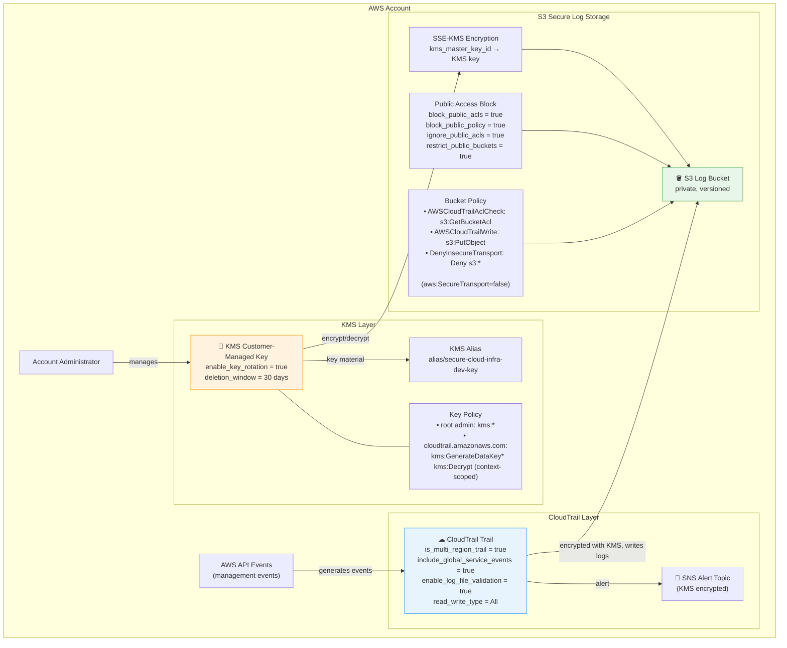

# Encryption and Logging Architecture

> **Holat:** Kod tayyorlangan, AWS resurslari hali real yaratilmagan.

## Umumiy tavsif

Loyiha AWS KMS customer-managed kalit va CloudTrail yordamida barcha ma'lumotlarni shifrlaydi va faoliyatni jurnalga yozadi.

## To'liq arxitektura diagrammasi



## KMS Key Policy — Least Privilege tahlili

### Root Administrator Statement
```json
{
  "Sid": "Enable account root administration",
  "Effect": "Allow",
  "Principal": { "AWS": "arn:aws:iam::ACCOUNT_ID:root" },
  "Action": "kms:*",
  "Resource": "*"
}
```
**Sabab:** AWS KMS talabi — hisob root'i kalit boshqaruvi uchun minimal zarur. Bu AWS standart tavsiyasi; bo'lmasa kalit bloklangan qolishi mumkin.

### CloudTrail Service Statement
```json
{
  "Sid": "Allow CloudTrail to use the key",
  "Effect": "Allow",
  "Principal": { "Service": "cloudtrail.amazonaws.com" },
  "Action": ["kms:GenerateDataKey*", "kms:Decrypt"],
  "Resource": "*",
  "Condition": {
    "StringLike": {
      "kms:EncryptionContext:aws:cloudtrail:arn": "arn:aws:cloudtrail:REGION:ACCOUNT:trail/NAME-*"
    }
  }
}
```
**Sabab:** Faqat `GenerateDataKey` va `Decrypt` — minimal kerakli. `Condition` bilan faqat bizning trail ARNiga cheklangan.

## CloudTrail xavfsizlik konfiguratsiyasi

| Sozlama | Qiymat | Maqsad |
|---|---|---|
| `is_multi_region_trail` | `true` | Barcha regionlardagi eventlarni qamrab olish |
| `include_global_service_events` | `true` | IAM, STS va boshqa global xizmatlar |
| `enable_log_file_validation` | `true` | Log fayllar o'zgartirilganini aniqlash |
| `kms_key_id` | customer-managed | Loglar shifrlanadi |
| `sns_topic_name` | alert topic | Hodisalar haqida bildirishnoma |
| `read_write_type` | `All` | Ham o'qish ham yozish eventlari |

## S3 Log Bucket xavfsizligi

| Xususiyat | Holat |
|---|---|
| Public Access Block (to'liq) | ✅ Yoqilgan (4/4 sozlama) |
| Versioning | ✅ Yoqilgan |
| Server-Side Encryption | ✅ SSE-KMS |
| HTTPS majburiy (DenyInsecureTransport) | ✅ Bucket Policy |
| Public ACL | ✅ Yo'q (private) |
| CloudTrail-only write | ✅ Bucket Policy bilan cheklangan |

## Terraform fayllar

- [`modules/encryption/main.tf`](../modules/encryption/main.tf) — KMS kalit va alias
- [`modules/encryption/variables.tf`](../modules/encryption/variables.tf) — o'zgaruvchilar
- [`modules/logging/main.tf`](../modules/logging/main.tf) — S3, CloudTrail, SNS, bucket policy
