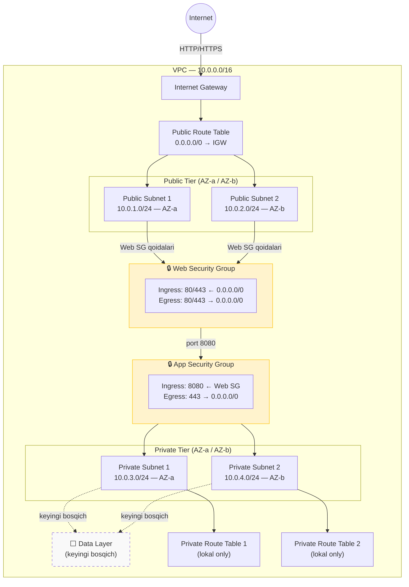

# Network Architecture

> **Holat:** Kod tayyorlangan, AWS resurslari hali real yaratilmagan.

## Arxitektura tavsifi

Loyiha 2 ta availability zone'da quyidagi network arxitekturasini amalga oshiradi:

- **VPC** (`10.0.0.0/16`) — izolyatsiya qilingan tarmoq muhiti
- **Public subnetlar** (2x `/24`) — internet-facing resurslar uchun; Internet Gateway orqali tashqariga chiqadi
- **Private subnetlar** (2x `/24`) — ichki resurslar uchun; hozircha NAT Gateway yo'q
- **Internet Gateway** — public subnetlarga internet kirish
- **Route tables** — public (IGW marshruti bor), private (faqat lokal marshrutlar)
- **Default Security Group** — barcha ingress/egress bloklangan
- **Web Security Group** — 80/443 portlarini internetdan qabul qiladi
- **Application Security Group** — faqat Web SG'dan 8080 portida trafik qabul qiladi

## Traffic Flow

```
Internet
   │
   ▼
Internet Gateway
   │
   ▼
Public Route Table → Public Subnet 1 / Public Subnet 2
   │
   │  Web Server (Public Subnet ichida)
   │  [Web Security Group qoidalari qo'llanadi: 80/443 ruxsat]
   │
   ▼ port 8080
Application Server (Private Subnet ichida)
   │  [App Security Group qoidalari qo'llanadi: faqat Web SG dan 8080]
   │
   ▼
Data Layer (keyingi bosqich — Private Subnet)
   │  [DB Security Group: faqat App SG dan, DB porti]
```

## Security Group arxitekturasi

Security Group'lar resurslarning o'ziga emas, **resurslar o'rtasidagi trafikka qo'llanadigan qoidalar** sifatida ishlaydi:

| Security Group | Ingress | Egress | Maqsad |
|---|---|---|---|
| `web-sg` | 0.0.0.0/0 → 80, 443 | 80, 443 → 0.0.0.0/0 | Internet web trafigini qabul qilish |
| `app-sg` | web-sg → 8080 | 443 → 0.0.0.0/0 | Faqat web qatlamdan ilova trafigi |
| `default-sg` | (bo'sh) | (bo'sh) | Standart SG bloklangan |

> **Muhim:** Security Group'lar diagrammada subnet'lar orasida emas, balki resurslar ustiga qo'llanadigan **xavfsizlik qoidalari qatlami** sifatida ko'rsatilishi kerak.

## Mermaid diagramma



## Terraform fayllar

- [`modules/network/main.tf`](../modules/network/main.tf) — VPC, subnetlar, IGW, route tables
- [`modules/security/main.tf`](../modules/security/main.tf) — Security Groups

## Xavfsizlik qarorlari

| Muammo | Qaror |
|---|---|
| SSH (22) internetga ochiq | ❌ Hech qachon ruxsat berilmaydi |
| RDP (3389) internetga ochiq | ❌ Hech qachon ruxsat berilmaydi |
| DB portlari internetga ochiq | ❌ Faqat App SG dan |
| NAT Gateway | ⏳ Keyingi bosqich (xarajat sabab) |
| VPC Flow Logs | ⏳ Keyingi bosqich |
