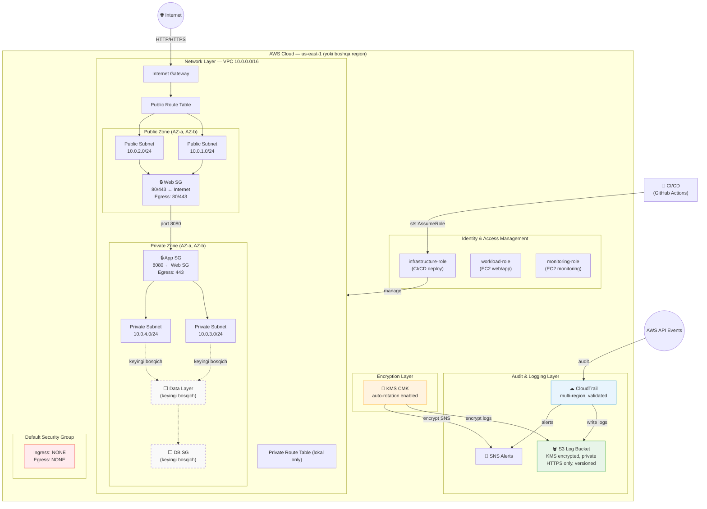

# Overall Architecture

> **Holat:** Kod tayyorlangan, AWS resurslari hali real yaratilmagan.

## Layered Security Architecture



## Xavfsizlik qatlamlari

| Qatlam | Texnologiya | Holat |
|---|---|---|
| **Network izolatsiya** | VPC, Public/Private Subnets | ✅ Tayyor |
| **Perimeter xavfsizligi** | Security Groups (web, app) | ✅ Tayyor |
| **Standart SG bloklash** | Default SG — ingress/egress yo'q | ✅ Tayyor |
| **Identity & Access** | IAM Roles + Least Privilege Policies | ✅ Tayyor |
| **Ma'lumot shifrlash** | KMS CMK + auto-rotation | ✅ Tayyor |
| **Audit logging** | CloudTrail multi-region + log validation | ✅ Tayyor |
| **Log xavfsizligi** | S3 KMS encrypted + HTTPS-only + versioned | ✅ Tayyor |
| **CI/CD xavfsizligi** | GitHub Actions + Checkov + secret scan | ✅ Tayyor |
| **VPC Flow Logs** | (NAT bilan birgalikda qo'shiladi) | ⏳ Keyingi bosqich |
| **WAF** | Web Application Firewall | ⏳ Keyingi bosqich |
| **Bastion Host** | SSH jump server | ⏳ Keyingi bosqich |

## Defense in Depth

```
Internet → [IGW] → [Route Table] → [Web SG: faqat 80/443]
                                         ↓
                                [Web Server: Public Subnet]
                                         ↓ port 8080
                               [App SG: faqat Web SG dan]
                                         ↓
                              [App Server: Private Subnet]
                                         ↓ DB port (keyingi)
                             [DB SG: faqat App SG dan]
                                         ↓
                                [Database: Private Subnet]

Parallel:
  All AWS API calls → [CloudTrail] → [KMS encrypt] → [S3 private bucket]
  IAM roles: minimal permissions, no wildcards
  KMS: CMK rotation enabled, scoped key policy
```
